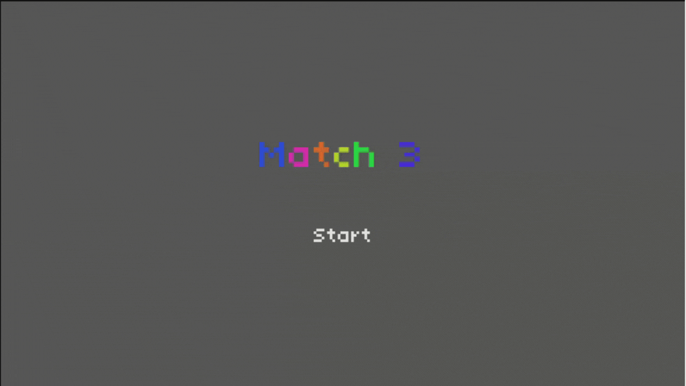
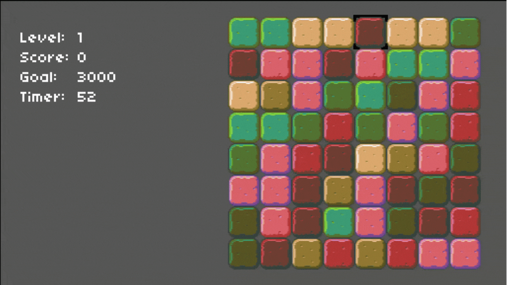

# Match 3

An implementation of the Match 3 game from [CS50's Game Development course](https://www.youtube.com/watch?v=jZqYXSmgDuM&list=PLWKjhJtqVAbluXJKKbCIb4xd7fcRkpzoz)
done using the Godot Engine. The course uses [Lua](https://www.lua.org/) and the [LÖVE](https://love2d.org/) game engine for this game.

## Gameplay

The game consists of randomly arranged tiles, where you should match-3 or more to get points (100 points for each tile matched). 
The goal is to get the number of points denoted by the goal before the timer runs out.

The game currently can only be played using the keyboard.

- To move the selection marker across the board. use the arrow keys.
- To select a tile, press `enter` and then one can swap it with the tiles next to it by selecting the desired tile.

## Status

The progran has a few bugs that need to be squashed and improvements to be added 
(e.g. using a better, more accessible tile set, matching different shapes and spawning powerups based on that, adding music and sound effects).
However, these just amount to a full re-write, and I'm highly unlikely to do it. The repository (will be/is) archived to reflect this state.
